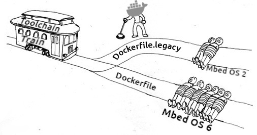

<p align="center">
  
</p>

Dockerfiles to work with [mbed-cli][] and [yotta][].

One for the latest boards, supported by Mbed OS 5/6, and one for dinosaurs,
running with Mbed OS 2. Some SDKs for the latter are requiring Python 2. That's
why we are having another Dockerfile.

```bash
# Build the Docker containers for current boards and dinosaurs
docker build -t arm-build-env .
docker build -t arm-build-legacy-env -f Dockerfile.legacy .

# Switch to your project and run one of those
docker run --rm -it -v `pwd`:/app arm-build-env bash
docker run --rm -it -v `pwd`:/app arm-build-legacy-env bash
```


[mbed-cli]:https://github.com/ARMmbed/mbed-cli
[yotta]:https://github.com/ARMmbed/yotta
